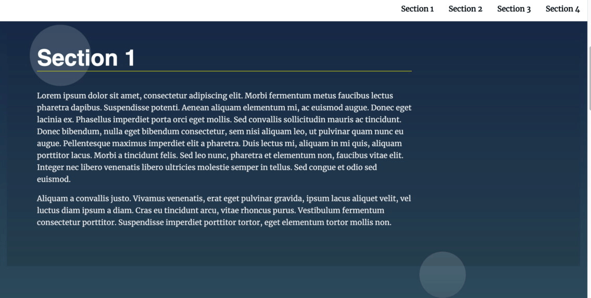

# landing-page-udacity
## Table of Contents

* [Project Overview](#projectOverview)
* [Usage](#Usage)
* [Example](#LandingPageBehavior)

## projectOverview
This project intends to provide you with practical examples of DOM manipulation. The functionality you use will accomplish two goals: it will get you ready for adding dynamically added data to the DOM and it will demonstrate how javascript can make a static site more user-friendly. This project uses some incredibly typical events, procedures, and reasoning, yet it only scratches the surface of what is possible.

## Usage
use in creating a landing page with multiple sections. The amount of content that will be added to a page via a CMS or an API is frequently unknown to us. We can add material to the page dynamically to get around this issue. The navigation menu serves as an illustration of this. Furthermore, learning about the virtual DOM is greatly aided by dynamically creating the navigation.

## LandingPageBehavior

## dependencies
code from udacity <a href="https://github.com/udacity/cd0428-landing-page/" target="_blank">Code</a>
contain html, css and js files
